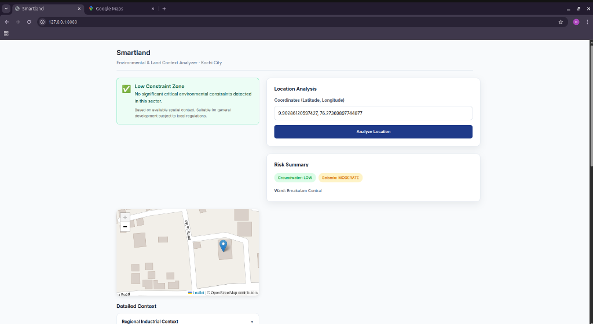
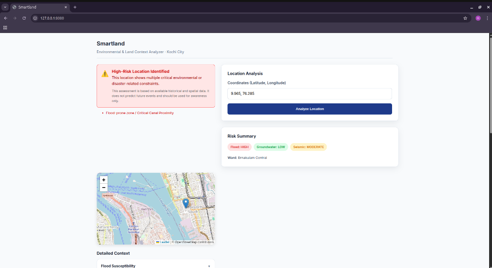
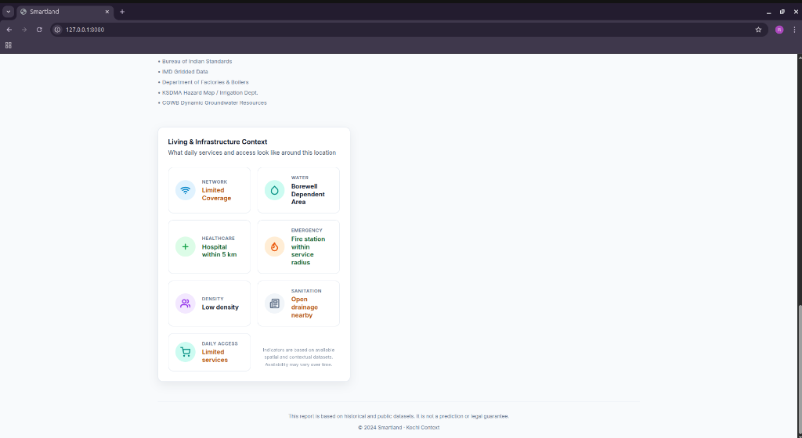

# Smartland


*Main analysis interface showing a 'Low Constraint' result for a safe location.*

Smartland is a location intelligence web application that helps people understand **whether a place is suitable for living or land investment** before making a decision.

The problem it solves is simple but serious.  
People often buy land or rent homes in unfamiliar areas without knowing the local risks, infrastructure gaps, or environmental constraints. These mistakes are expensive and usually discovered too late.

Smartland converts a geographic coordinate into **clear, decision-oriented context** using deterministic spatial analysis and public datasets.

No predictions.  
No AI guessing.  
Only explainable logic.

---

## How Smartland Works

Given a latitude and longitude:

- Validates the location against supported city boundaries
- Places the point on an interactive map
- Analyzes the location using spatial rules and datasets
- Presents risks and livability indicators in a clear, scannable UI
- Signals whether the area shows low, moderate, or high constraints

The output is designed for **real estate and living decisions**, not raw data exploration.

### Intelligent Risk Context

*Example of a high-risk location warning triggered by flood and industrial context.*

---

## Current Scope

- City: Kochi
- Designed for controlled expansion to other cities
- Focused on accuracy and clarity over scale

The scope is intentionally limited to avoid misleading results.

---

## Key Features

### Location Analysis
- Single input for Google Maps style coordinates
- Automatic latitude and longitude parsing
- Strong input validation and boundary enforcement

### Environmental Risk Context
- Flood susceptibility indicators
- Canal and drainage proximity checks
- Seismic zone classification
- Climate and rainfall context

### Living & Infrastructure Context

*Example of infrastructure and livability indicators generated for a location.*

- Network availability
- Water source dependency
- Healthcare access
- Fire and rescue coverage
- Area density
- Sanitation indicators
- Daily living access

Each indicator is shown as a **status**, not a paragraph.

### Detailed Context & Sources

*Detailed breakdown of environmental and regulatory context data.*

### Decision Signals
- Low constraint location
- Moderate constraint location
- High constraint location

These signals are derived from deterministic rules combining environmental risk, disaster exposure, and infrastructure constraints across datasets.

---

## What Smartland Does Not Do

- No machine learning
- No future prediction
- No black-box scoring
- No external APIs at runtime

Every result can be traced back to a dataset and a rule.

---

## Technical Architecture

### Backend
- FastAPI
- Deterministic spatial logic
- Point-in-polygon checks
- Proximity-based evaluations
- GeoJSON datasets loaded into memory

### Frontend
- Vanilla JavaScript
- Leaflet for mapping
- Responsive, real-estate grade UI
- Clear visual hierarchy
- No frontend frameworks

### Data Handling
- GeoJSON-based datasets
- Stored locally for transparency
- Loaded at application startup
- No database dependency

---

## Project Structure

```
smartland/
├── backend/
│   ├── app.py
│   ├── loader.py
│   ├── spatial_rules.py
│   ├── generate_mock_data.py
│   └── data_store/
│       ├── boundaries.geojson
│       ├── canals.geojson
│       ├── infrastructure.geojson
│
├── frontend/
│   ├── index.html
│   ├── ui.js
│   └── base.css
│
└── README.md
```

Frontend renders the data.  
Backend owns all decision logic.

---

## Running Locally

### Backend
```bash
source venv/bin/activate
python backend/generate_mock_data.py
uvicorn backend.app:app --reload
```
Runs at: http://localhost:8000

### Frontend
```bash
python3 -m http.server 8080 --directory frontend
```
Open: http://localhost:8080

### Example Input
`9.929582557601877, 76.30895255827387`

The system:
1. Parses coordinates
2. Validates range
3. Maps the location
4. Runs spatial checks
5. Returns structured context

## Data Sources
Smartland uses public and historical datasets, including:
- CGWB Dynamic Groundwater Resources
- IMD Gridded Climate Data
- Department of Factories & Boilers
- Bureau of Indian Standards
- Government flood and drainage reports

## Disclaimer

Smartland provides context, not guarantees.

All outputs are based on available datasets and deterministic rules.
It is not a prediction system and not a legal authority.

## Why This Project Matters

This project demonstrates:
- Practical spatial reasoning
- Explainable decision logic
- Strong separation of concerns
- Product-first UI thinking
- Respect for data limitations

Smartland is built as decision support software, not a demo.

## Future Scope

- Multi-city expansion
- Transport and accessibility layers
- Emergency response time modeling
- Dataset versioning and traceability

The foundation is already in place.

## Author

Built by a developer focused on building explainable, decision-support software with real-world constraints in mind.
>>>>>>> e721248 (Initial commit: Smartland location intelligence platform)
